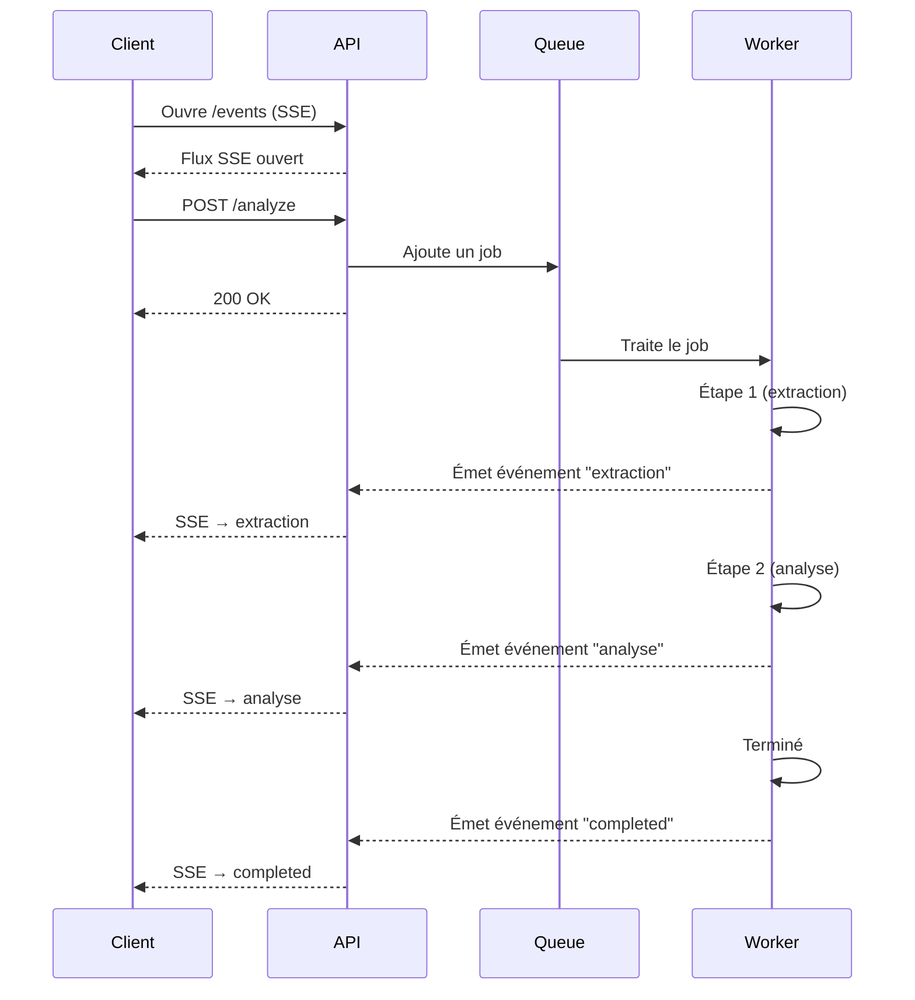

<p align="center">
  
</p>

# SSE + BullMQ queue demo

Runnable example of **background jobs with [BullMQ](https://docs.bullmq.io/)** and **progress updates over [Server-Sent Events (SSE)](https://developer.mozilla.org/en-US/docs/Web/API/Server-sent_events)** in a NestJS API consumed by a React SPA.

This repository is **based on the [Lonestone boilerplate](https://github.com/lonestone/lonestone-boilerplate)**. For the full stack template, tooling, and extended documentation, see that project and its [published docs](https://lonestone.github.io/lonestone-boilerplate/).

## 📋 Table of Contents

- [About this demo](#-about-this-demo)
- [How it works](#-how-it-works)
- [Overview](#-overview)
- [Tech Stack](#️-tech-stack)
- [Project Structure](#-project-structure)
- [Prerequisites](#-prerequisites)
- [Installation](#-installation)
- [Docker Services](#-docker-services)
- [Useful Commands](#️-useful-commands)
- [Development](#-development)
- [Documentation](#-documentation)

## 🎯 About this demo

This codebase is a **companion implementation** for two articles on **processing heavy tasks in Node.js**: it shows how to offload long-running work to a queue, run it in a worker, and **stream step-by-step progress** to the browser without blocking HTTP request/response cycles.

The sample flow simulates an analysis pipeline (e.g. extraction → analysis → completed) and pushes named events over SSE so the client can update UI state in real time.

## 🔄 How it works

At a high level: the client keeps an SSE connection open, enqueues work with a normal HTTP POST, and receives events as the worker advances.



**Concrete routes in this repo** (global API prefix `/api`):

- `GET /api/analysis/events` — SSE stream of analysis updates  
- `POST /api/analysis/:id/analyze` — enqueue a job for the given id  

The worker emits progress; the API forwards it to subscribers on the SSE channel (see `apps/api/src/modules/analysis/`).

## 🔍 Overview

The repo is a **pnpm monorepo**: a NestJS API, a Vite + React SPA, and shared packages (OpenAPI client, UI, i18n). Redis backs BullMQ; there is no database requirement for this demo’s queue/SSE path.

## 🛠️ Tech Stack

- **API**: NestJS, BullMQ, Zod, OpenAPI / Nzoth  
- **Frontend**: React, React Router, TanStack Query, Tailwind CSS  
- **Infrastructure (local)**: Redis via Docker Compose  

For broader architectural patterns from the upstream template, see the [Lonestone boilerplate](https://github.com/lonestone/lonestone-boilerplate) and its documentation.

## 📁 Project Structure

| Path | Role |
|------|------|
| `apps/api` | NestJS API, BullMQ queue + worker processor, SSE endpoint |
| `apps/web-spa` | SPA: opens SSE, starts analysis, displays live steps |
| `packages/openapi-generator` | Generated types and client (including SSE helpers) |
| `packages/ui` | Shared UI components |
| `packages/i18n` | Shared i18n utilities |

## 📋 Prerequisites

- [Node.js](https://nodejs.org/) (see `engines` in root `package.json`, e.g. 24.13.0)
- [pnpm](https://pnpm.io/) (version pinned in `package.json` → `packageManager`)
- [Docker](https://www.docker.com/) and [Docker Compose](https://docs.docker.com/compose/) for Redis

## 🚀 Installation

1. Clone the repository and enter the project root.

2. Use the Node and pnpm versions expected by the repo (e.g. with [fnm](https://github.com/Schniz/fnm)):

```bash
fnm use
corepack enable
pnpm install
```

3. Copy environment examples and adjust ports/origins if needed:

```bash
cp .env.example .env
cp apps/api/.env.example apps/api/.env
cp apps/web-spa/.env.example apps/web-spa/.env
cp packages/openapi-generator/.env.example packages/openapi-generator/.env
```

Align `CLIENTS_WEB_APP_URL`, `TRUSTED_ORIGINS`, and `VITE_API_URL` with the URL your SPA actually uses in dev.

4. Start **Redis**:

```bash
pnpm docker:up
```

5. Start apps in development:

```bash
pnpm dev
```

See [apps/api/README.md](apps/api/README.md) and [apps/web-spa/README.md](apps/web-spa/README.md) for app-specific details.

## 🐳 Docker Services

Compose currently provides:

- **Redis** — broker/backing store for BullMQ (`REDIS_PORT` in `.env` maps to container `6379`).

## ⌨️ Useful Commands

### Docker

- **Start**: `pnpm docker:up`
- **Stop**: `pnpm docker:down`
- **Logs**: `pnpm docker:logs`

### Development

- **All apps (parallel)**: `pnpm dev`
- **API only**: `pnpm --filter=api dev`
- **Web SPA only**: `pnpm --filter=web-spa dev`
- **Build**: `pnpm build`
- **Lint**: `pnpm lint`
- **OpenAPI client**: `pnpm generate`
- **Tests**: `pnpm test`

## 💻 Development

- **API** — NestJS module `analysis`: controller (SSE + enqueue), service, BullMQ processor, event bridge to SSE subscribers. OpenAPI UI in development: `http://localhost:<API_PORT>/api/docs`.
- **Web SPA** — Analysis feature hooks/components consume the SSE stream and trigger `POST .../analyze`.

Shared API types and client live under `packages/openapi-generator` after generation.

## 📚 Documentation

- [Lonestone boilerplate](https://github.com/lonestone/lonestone-boilerplate) — upstream template this demo is derived from  
- [Boilerplate documentation site](https://lonestone.github.io/lonestone-boilerplate/)  
- [API README](apps/api/README.md)  
- [Web SPA README](apps/web-spa/README.md)  
