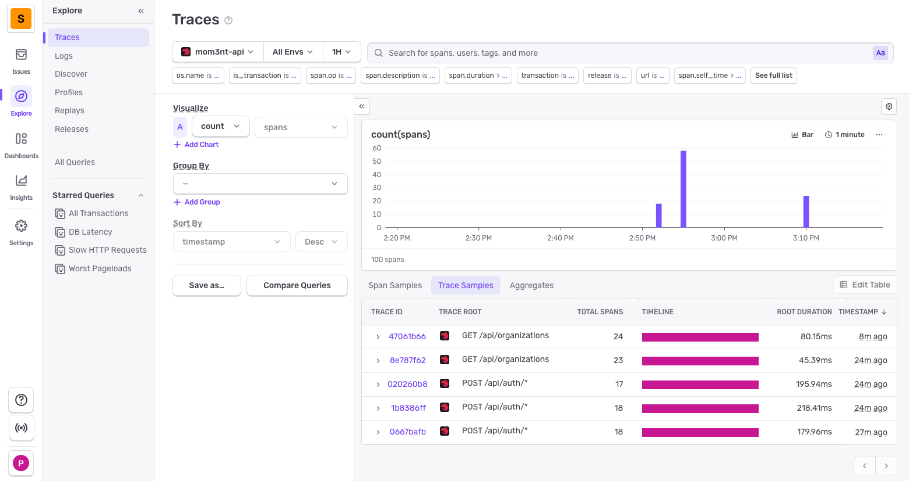
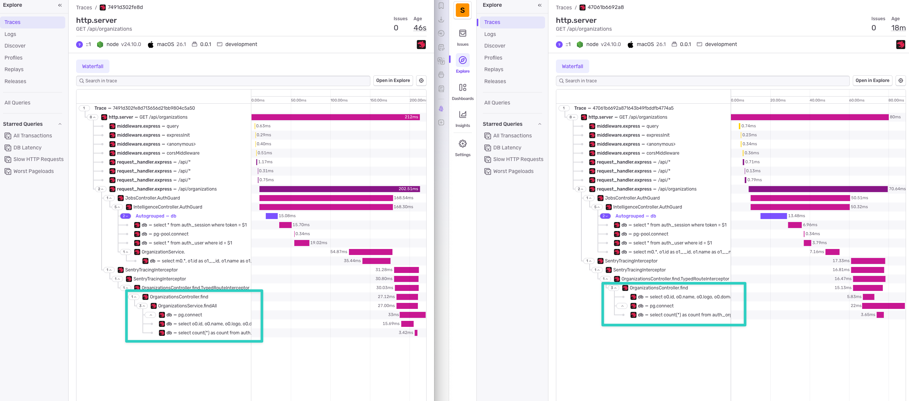
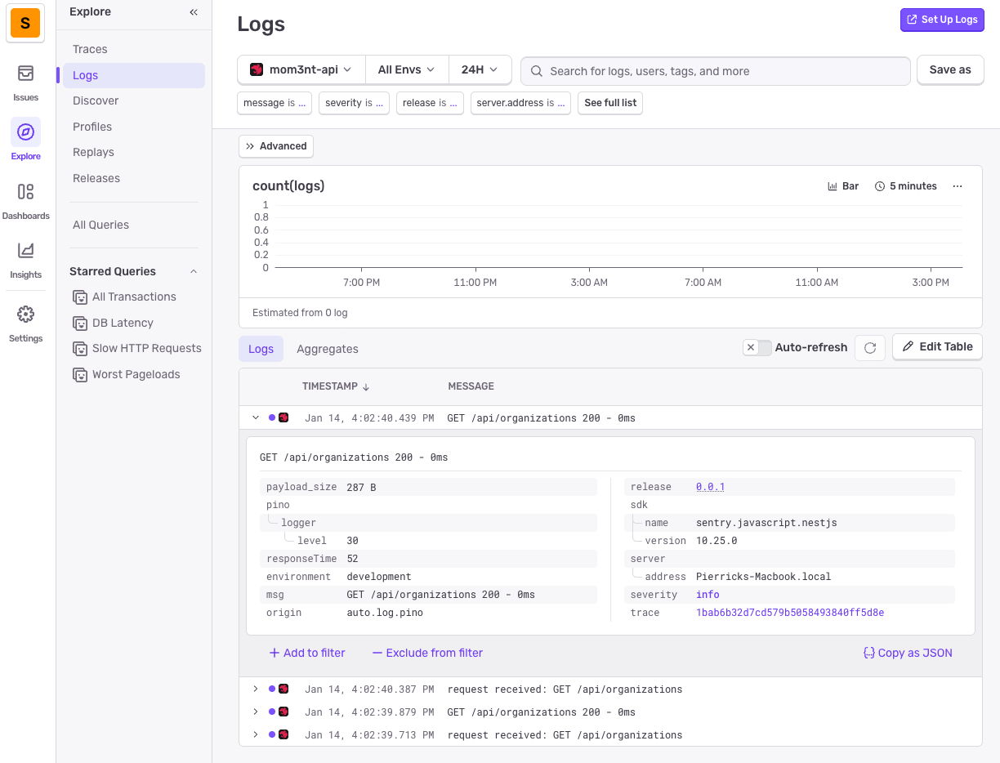

import { Steps, Aside } from '@astrojs/starlight/components';

The project uses [Sentry](https://sentry.io/) (or a Sentry-compatible alternative like [Bugsink](https://www.bugsink.com/)) for error reporting, tracing, and structured logging. Everything is already configured and ready to use.

## Why this matters

Debugging in production can be painful. How many times have you been stuck in a situation where:

- The client / manager has a hard time giving you reproduction steps or context
- You can't reproduce the issue locally
- You can't access or find the right logs (because they're in a container that gets erased after deployment)

Good monitoring tools can save you hours, days, or even weeks of debugging. Thanks to OpenTelemetry, they're now easier to set up and use.

## Why Sentry and OpenTelemetry

**Sentry** is the de facto standard for error reporting with great UX and integrations with many frameworks. It can also be self-hosted. Plus, if you want to use an open source alternative, you can use [Bugsink](https://www.bugsink.com/) which is a Sentry-compatible alternative (without logging and tracing though).

**OpenTelemetry** has become the standard for logging and tracing. Sentry is compatible with it, and you can switch to alternatives like [Signoz](https://signoz.io/) thanks to OTEL compatibility.

# ❓ How it works

The monitoring stack provides three main capabilities:

1. **Error Reporting**: Automatic capture of unhandled exceptions with full stack traces and context****
2. **Distributed Tracing**: Performance monitoring with OpenTelemetry, tracking request flows across your application
3. **Structured Logging**: Pino logs are automatically sent to Sentry for centralized log management

## Architecture Overview

The monitoring system is initialized in `apps/api/src/instrument.ts` before the NestJS application starts. Under the hood, Sentry leverages OpenTelemetry to capture traces, its own SDK to track errors and Pino for logging.

We also use [amplication/opentelemetry-nestjs](https://github.com/amplication/opentelemetry-nestjs) to automatically trace controllers, services, database queries, etc. so we have complete traces.

<Aside type="note" title="Why skipOpenTelemetrySetup?">
Sentry is initialized with `skipOpenTelemetrySetup: true` to prevent it from claiming the global OpenTelemetry provider. This allows us to create a **shared TracerProvider** that routes spans to multiple destinations (Sentry and Langfuse). Without this flag, Sentry would take over the global provider, preventing other processors from receiving spans. If you want to use Sentry without Langfuse, you can remove this flag.
</Aside>

## Configuration Options

The Sentry initialization in `instrument.ts` provides several important options:

```typescript title="src/instrument.ts"
Sentry.init({
  dsn: config.sentry.dsn,
  environment: config.env,
  release: config.version,

  // Capture 100% of traces - reduce in production!
  // Setting this above 0 automatically enables OpenTelemetry tracing.
  tracesSampleRate: 1.0,

  // Send default PII data (e.g., IP addresses)
  sendDefaultPii: true,

  // Enable structured logging via Pino
  enableLogs: true,
  integrations: [Sentry.pinoIntegration()],

  // Prevents Sentry from claiming global provider, allowing shared TracerProvider
  skipOpenTelemetrySetup: true,
})
```

<Aside type="caution" title="Performance in Production">
The `tracesSampleRate: 1.0` setting captures 100% of traces, which is useful during development but can be expensive in production with high traffic. 

**Recommended production settings:**
- `tracesSampleRate: 0.1` (10% of traces) for high-traffic applications
- `tracesSampleRate: 0.25` (25% of traces) for medium-traffic applications

For error tracking, you can also use [dynamic sampling](https://docs.sentry.io/platforms/javascript/configuration/sampling/) for more granular control.
</Aside>

# 📝 How to use

Since Sentry is already configured in the boilerplate, you only need to:

<Steps>
1. ### Set up your Sentry project
   Create a project in [Sentry](https://sentry.io/) (or your self-hosted instance) and get your DSN.

2. ### Configure environment variables
   Add the following to your `apps/api/.env` file:

   ```env
   SENTRY_DSN=https://<your-dsn>@sentry.io/<your-project>
   ```

3. ### Start monitoring
   That's it! Errors, traces, and logs are automatically captured.
</Steps>

## Viewing Errors

Unhandled exceptions are automatically captured and sent to Sentry with:
- Full stack traces
- Request context (URL, headers, body)
- User information (if authenticated)
- Environment and release information

## Viewing Traces

Traces show the full request flow through your application:



### Adding granular tracing

By default, OpenTelemetry doesn't capture all method calls (only guards, controllers, DB queries, etc.). For more granular details, add the `@Traceable()` decorator at the class level:

```typescript
import { Traceable } from '@amplication/opentelemetry-nestjs'

@Traceable()
@Injectable()
export class UserService {
  constructor(private readonly userRepository: UserRepository) {}
}
```



On the left, you can see the added granularity (service methods are now visible), which makes performance analysis much easier.

## Viewing Logs

Structured logs from Pino are automatically sent to Sentry:



<Aside type="note">
Ensure your `pino`, `pino-http`, and `pino-pretty` packages are up to date. Older versions may not work correctly with Sentry. The minimum required versions are already configured in the API `package.json`.
</Aside>

# 🧹 How to remove

<Steps>
1. ### Remove the instrument file
   Delete `apps/api/src/instrument.ts`

2. ### Update app.module.ts
   Remove the Sentry and OpenTelemetry imports and configuration:

   ```typescript title="src/app.module.ts"
   // Remove these imports
   import { OpenTelemetryModule } from '@amplication/opentelemetry-nestjs'
   import { APP_FILTER } from '@nestjs/core'
   import { SentryGlobalFilter, SentryModule } from '@sentry/nestjs/setup'

   @Module({
     imports: [
       // Remove these two lines:
       OpenTelemetryModule.forRoot(),
       SentryModule.forRoot(),
     ],
     providers: [
       // Remove this provider:
       {
         provide: APP_FILTER,
         useClass: SentryGlobalFilter,
       },
     ],
   })
   export class AppModule {}
   ```

3. ### Remove @Traceable decorators
   If you added `@Traceable()` decorators to any services for granular tracing, remove them:

   ```typescript
   // Remove @Traceable() and its import
   import { Traceable } from '@amplication/opentelemetry-nestjs'

   @Traceable() // Remove this line
   @Injectable()
   export class YourService {}
   ```

4. ### Remove dependencies
   Remove the following from `apps/api/package.json`:

   ```json
   "@amplication/opentelemetry-nestjs",
   "@opentelemetry/sdk-trace-node",
   "@sentry/nestjs",
   "@sentry/opentelemetry",
   ```

   Then run `pnpm install` to update the lockfile.

5. ### Remove environment variables
   Remove from `apps/api/.env` and `apps/api/.env.example`:

   ```env
   SENTRY_DSN=
   ```

6. ### Update env.config.ts
   Remove the Sentry configuration from `apps/api/src/config/env.config.ts`:

   ```typescript
   // Remove from configValidationSchema:
   SENTRY_DSN: z.string().optional(),

   // Remove from config object:
   sentry: {
     dsn: configParsed.data.SENTRY_DSN,
   },
   ```
</Steps>

<Aside type="caution">
If you're using the AI module with Langfuse, you'll need to update the tracing setup. Langfuse can work without Sentry, but you'll need to configure its own TracerProvider. See the [Langfuse documentation](https://langfuse.com/docs) for standalone setup.
</Aside>
